# 📸 Evidencias Gráficas - Pizzería Don Piccolo

Documento de evidencias visuales del proyecto SQL. Todas las capturas fueron tomadas en MySQL Workbench y se encuentran en la carpeta `imagenes/`.

---

## 🗂️ 1. Diagrama Entidad-Relación

### 📸 Diagrama ER (MySQL Workbench)

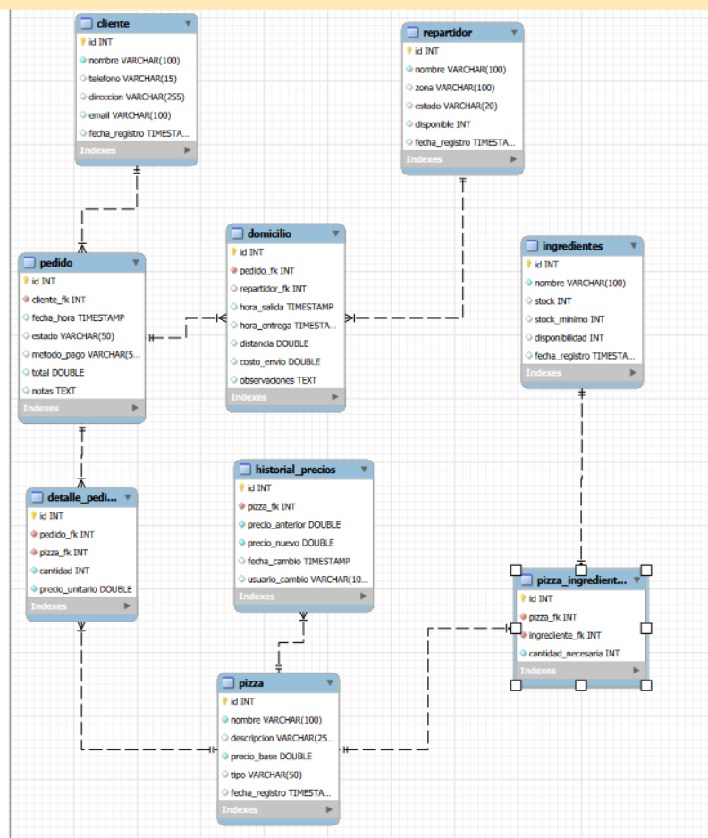

### Descripción Textual del Modelo

```
┌────────────────────────────────────────────────────────────────────────────────┐
│                         PIZZERIA DON PICCOLO - ER                             │
├────────────────────────────────────────────────────────────────────────────────┤
│                                                                                │
│  DATOS MAESTROS:                                                              │
│  • CLIENTE (id, nombre, telefono, direccion, email, fecha_registro)           │
│  • REPARTIDOR (id, nombre, zona, estado, disponible, fecha_registro)         │
│  • INGREDIENTES (id, nombre, stock, stock_minimo, disponibilidad)            │
│  • PIZZA (id, nombre, descripcion, precio_base, tipo)                        │
│                                                                                │
│  RELACIONES:                                                                  │
│  • PIZZA ←→ PIZZA_INGREDIENTES ←→ INGREDIENTES (N:M)                         │
│  • CLIENTE → PEDIDO → DETALLE_PEDIDO → PIZZA                                 │
│  • PEDIDO → DOMICILIO ← REPARTIDOR                                           │
│  • PIZZA → HISTORIAL_PRECIOS (Auditoría)                                      │
│                                                                                │
└────────────────────────────────────────────────────────────────────────────────┘
```

---

## ✅ 2. Creación de Base de Datos

### 📸 Ejecución de `tablas_y_estructura.sql`

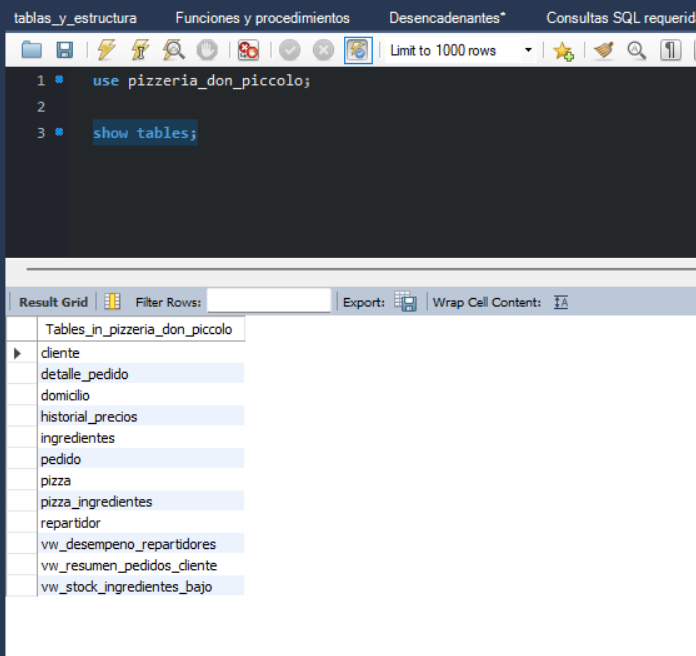

Captura de la creación de las 9 tablas del modelo (cliente, pizza, ingredientes, pizza_ingredientes, pedido, detalle_pedido, repartidor, domicilio, historial_precios).

---

## 👁️ 3. Vistas SQL

### Vista 1: Resumen de Pedidos por Cliente — `vw_resumen_pedidos_cliente`

```sql
SELECT * FROM vw_resumen_pedidos_cliente
WHERE cantidad_pedidos > 0
ORDER BY total_gastado DESC;
```

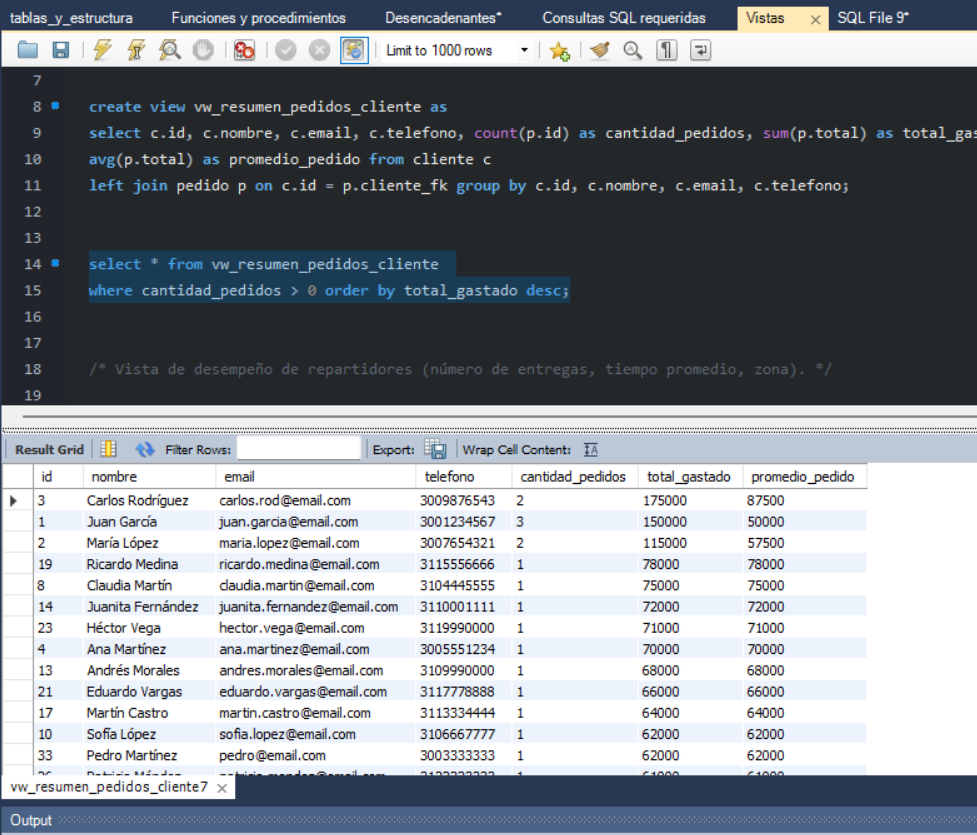

Muestra, por cliente: cantidad de pedidos, total gastado y promedio por pedido.

---

### Vista 2: Desempeño de Repartidores — `vw_desempeno_repartidores`

```sql
SELECT * FROM vw_desempeno_repartidores
WHERE numero_entregas > 0
ORDER BY numero_entregas DESC;
```

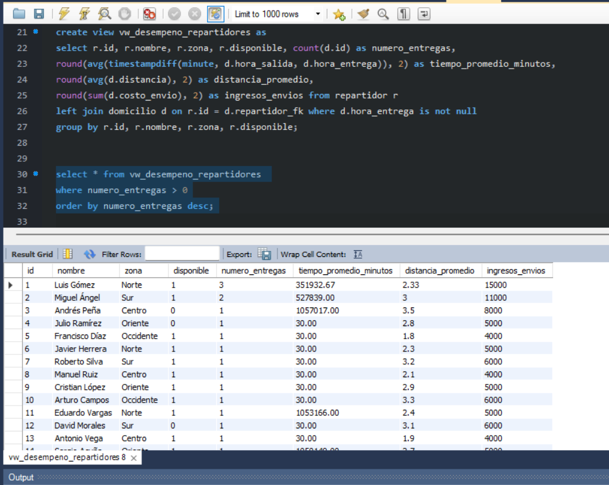

Muestra número de entregas, tiempo promedio de entrega, distancia promedio e ingresos por envíos, agrupados por repartidor y zona.

---

### Vista 3: Stock de Ingredientes Bajo — `vw_stock_ingredientes_bajo`

```sql
SELECT * FROM vw_stock_ingredientes_bajo
ORDER BY faltante DESC;
```

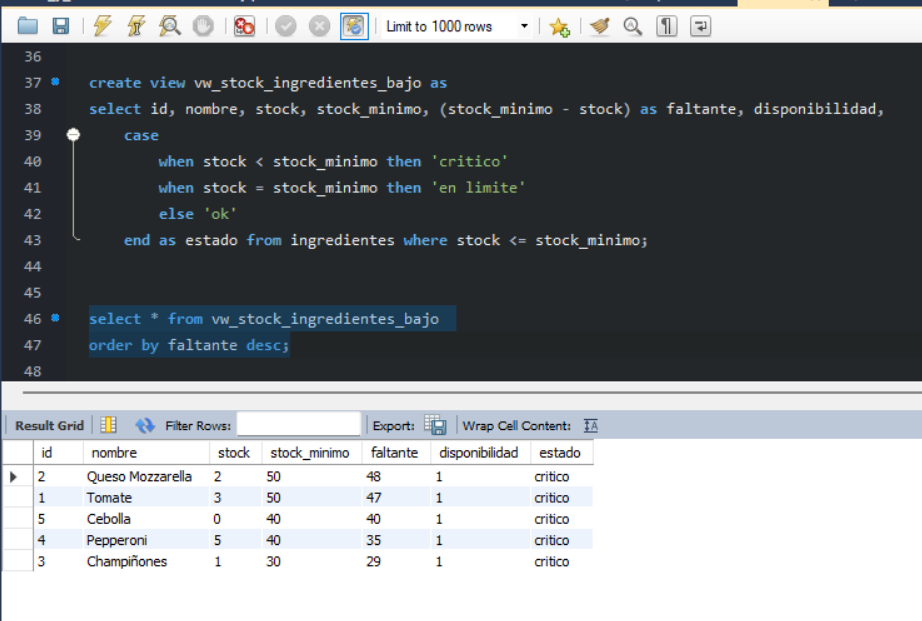

Ingredientes en o por debajo del stock mínimo, con la cantidad faltante y el estado (`crítico` / `en límite` / `ok`).

---

## ⚙️ 4. Funciones y Procedimientos

### Función 1: Calcular Total del Pedido — `fn_calcular_total_pedido(p_pedido_id)`

```sql
SELECT p.id, c.nombre, p.total,
    fn_calcular_total_pedido(p.id) AS total_calculado_con_iva
FROM pedido p
JOIN cliente c ON p.cliente_fk = c.id
LIMIT 5;
```

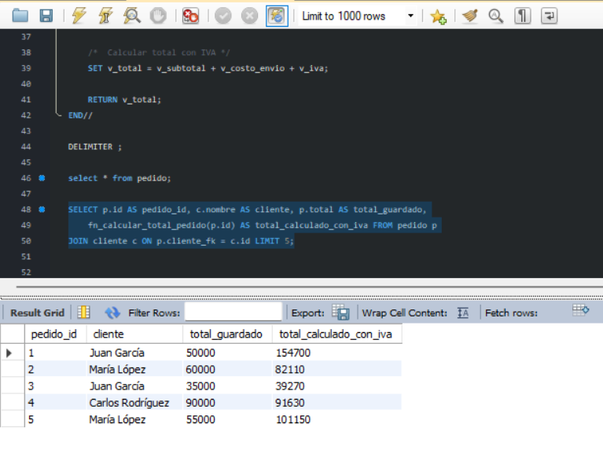

Calcula subtotal de pizzas + costo de envío, y aplica IVA del 19%.

---

### Función 2: Ganancia Neta Diaria — `fn_ganancia_neta_diaria(p_fecha)`

```sql
SELECT fecha, total_pedidos, ventas,
    ROUND(ventas * 0.30, 2) AS costo_ingredientes_30_porciento,
    fn_ganancia_neta_diaria(fecha) AS ganancia_neta
FROM (...) AS datos
ORDER BY fecha DESC;
```

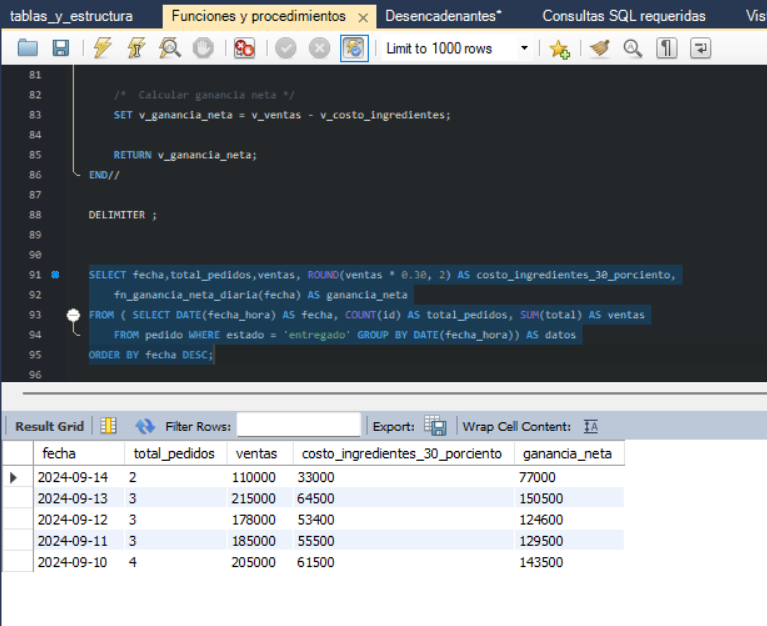

Ganancia = Ventas del día (pedidos entregados) − 30% estimado de costo de ingredientes.

---

### Procedimiento: Marcar Pedido como Entregado — `sp_marcar_entregado(p_domicilio_id)`

```sql
CALL sp_marcar_entregado(15);

SELECT d.id, d.pedido_fk, d.hora_entrega, p.id AS pedido_id, p.estado
FROM domicilio d
JOIN pedido p ON d.pedido_fk = p.id
WHERE d.id = 15;
```

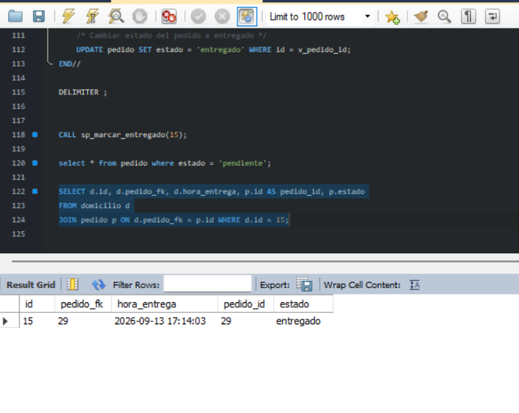

Actualiza la hora de entrega del domicilio y cambia el estado del pedido a `entregado`.

---

## 🔔 5. Triggers (Disparadores)

### Trigger 1: Descuento Automático de Stock — `tr_actualizar_stock_pedido`

```sql
INSERT INTO detalle_pedido (pedido_fk, pizza_fk, cantidad, precio_unitario)
VALUES (1, 1, 1, 25000);
```

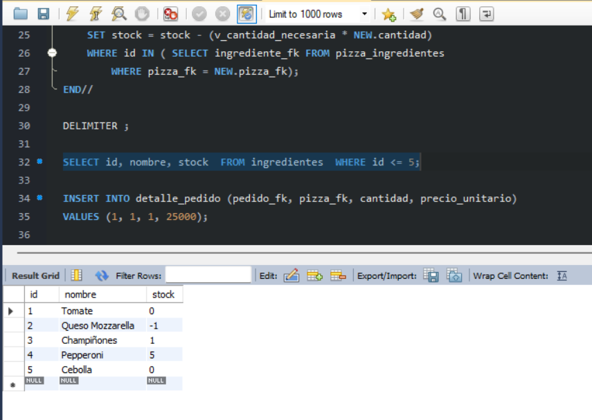

`AFTER INSERT` en `detalle_pedido`: descuenta del stock de ingredientes la cantidad necesaria para preparar la pizza.

---

### Trigger 2: Auditoría de Cambio de Precio — `tr_auditar_cambio_precio`

```sql
UPDATE pizza SET precio_base = 35000 WHERE id = 1;

SELECT pizza_fk, precio_anterior, precio_nuevo, fecha_cambio, usuario_cambio
FROM historial_precios
WHERE pizza_fk = 1
ORDER BY fecha_cambio DESC;
```

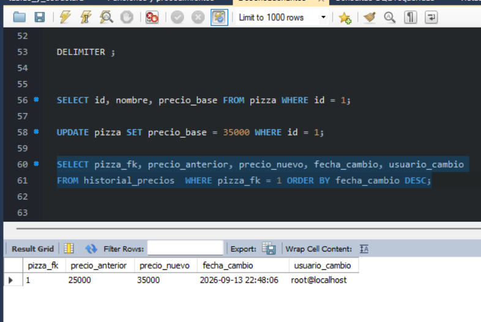

`BEFORE UPDATE` en `pizza`: si el precio cambia, registra el precio anterior y el nuevo en `historial_precios`.

---

### Trigger 3: Liberar Repartidor — `tr_liberar_repartidor`

```sql
UPDATE domicilio SET hora_entrega = NOW() WHERE id = 41;
```

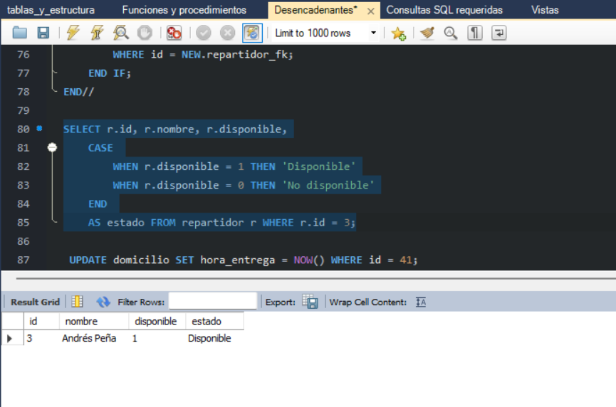

`AFTER UPDATE` en `domicilio`: cuando se registra la hora de entrega, marca al repartidor asignado como `disponible`.

---

## 📊 6. Consultas SQL Avanzadas

### Consulta 1: Clientes con Pedidos entre 2 Fechas (BETWEEN)

```sql
SELECT c.id, c.nombre, p.id, p.fecha_hora, p.total
FROM cliente c
JOIN pedido p ON c.id = p.cliente_fk
WHERE p.fecha_hora BETWEEN '2024-09-10' AND '2024-09-15'
ORDER BY p.fecha_hora DESC;
```

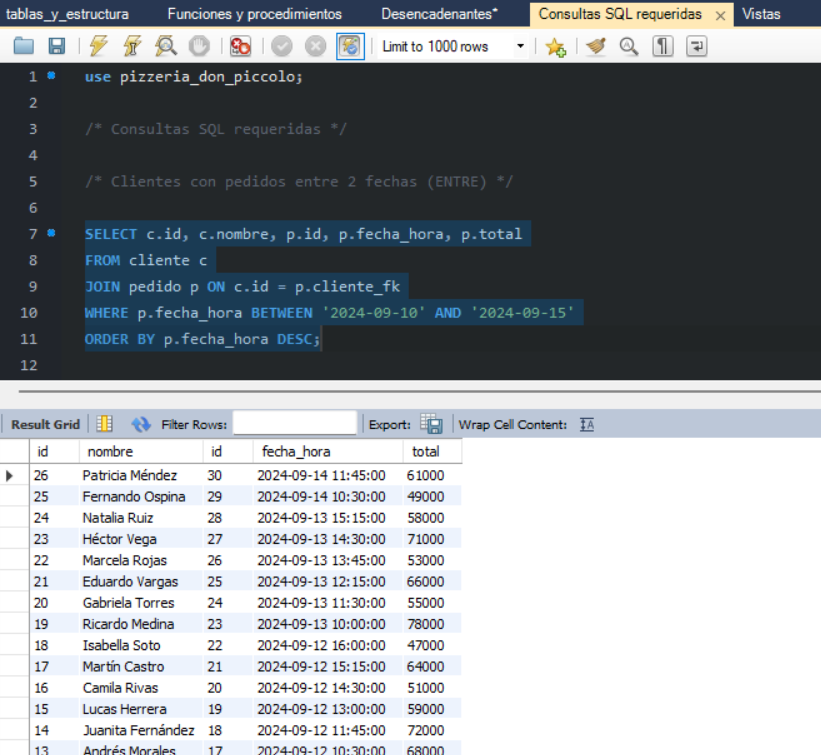

---

### Consulta 2: Pizzas Más Vendidas (GROUP BY + COUNT)

```sql
SELECT p.id, p.nombre, COUNT(dp.id) AS cantidad_vendida
FROM pizza p
LEFT JOIN detalle_pedido dp ON p.id = dp.pizza_fk
GROUP BY p.id, p.nombre
ORDER BY cantidad_vendida DESC
LIMIT 10;
```

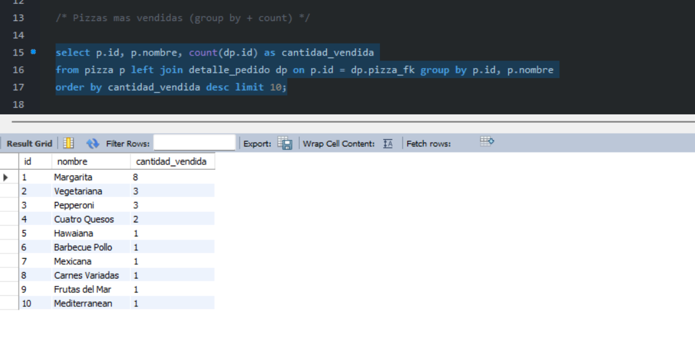

---

### Consulta 3: Pedidos por Repartidor

```sql
SELECT r.id, r.nombre, r.zona, COUNT(d.id) AS total_entregas
FROM repartidor r
LEFT JOIN domicilio d ON r.id = d.repartidor_fk
GROUP BY r.id, r.nombre, r.zona
ORDER BY r.id;
```

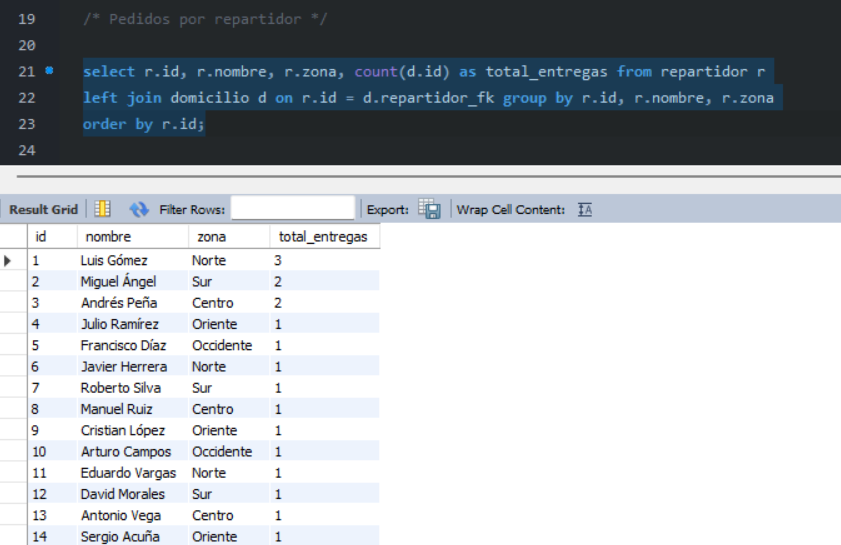

---

### Consulta 4: Promedio de Entrega por Zona (AVG + JOIN)

```sql
SELECT r.zona, AVG(TIMESTAMPDIFF(MINUTE, d.hora_salida, d.hora_entrega)) AS promedio_minutos
FROM repartidor r
LEFT JOIN domicilio d ON r.id = d.repartidor_fk
WHERE d.hora_entrega IS NOT NULL
GROUP BY r.zona;
```

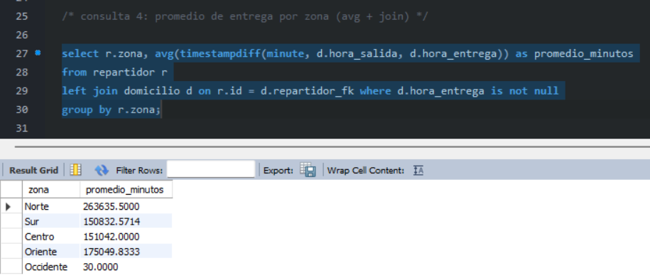

---

### Consulta 5: Búsqueda por Coincidencia Parcial (LIKE)

```sql
SELECT id, nombre, descripcion, precio_base, tipo
FROM pizza
WHERE nombre LIKE '%pollo%'
ORDER BY nombre;
```

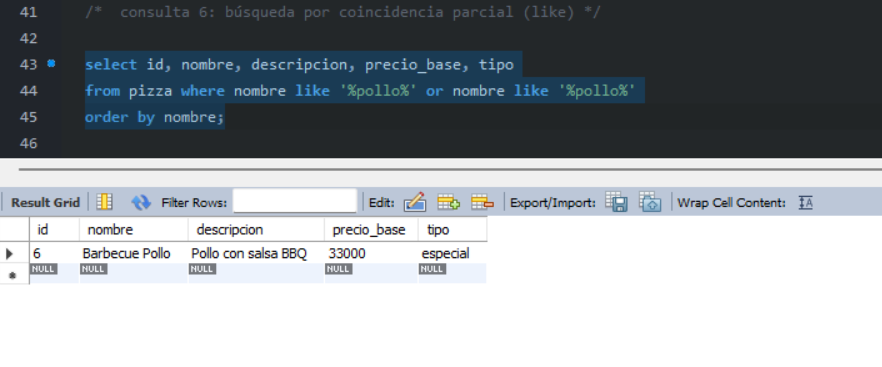

---

### Consulta 6: Clientes Frecuentes (Subconsulta)

```sql
SELECT c.id, c.nombre, c.telefono, COUNT(p.id) AS total_pedidos, SUM(p.total) AS total_gastado
FROM cliente c
LEFT JOIN pedido p ON c.id = p.cliente_fk
WHERE p.id IS NOT NULL
GROUP BY c.id, c.nombre, c.telefono
HAVING COUNT(p.id) >= 1
ORDER BY total_pedidos DESC;
```

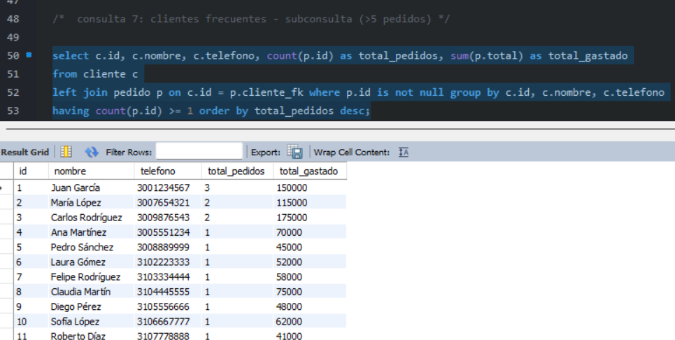

> **Nota:** la consulta de clientes que gastaron más de $100.000 (HAVING SUM) no tiene una captura dedicada dentro de las 17 imágenes disponibles; puede agregarse como `18_consulta_clientes_vip.png` si se captura más adelante.

---

## 📋 7. Resumen de Evidencias Capturadas

### Checklist de Capturas

```markdown
### Estructura Base
- [x] 01_diagrama_er.png — Diagrama ER de MySQL Workbench
- [x] 02_creacion_tablas.png — Ejecución de creación de tablas

### Vistas (3)
- [x] 03_vista_cliente.png — Vista resumen de pedidos por cliente
- [x] 04_vista_repartidores.png — Vista desempeño de repartidores
- [x] 05_vista_stock.png — Vista stock de ingredientes bajo

### Funciones y Procedimientos (3)
- [x] 06_funcion_total.png — Función calcular total del pedido
- [x] 07_ganancia_neta.png — Función ganancia neta diaria
- [x] 08_cambio_de_estado.png — Procedimiento marcar pedido entregado

### Triggers (3)
- [x] 09_disparador_detalle_pedido.png — Trigger descuento de stock
- [x] 10_disparador_cambio_de_precio.png — Trigger auditoría de precio
- [x] 11_disparador_cambio_estado_repartidor.png — Trigger liberar repartidor

### Consultas Avanzadas (6)
- [x] 12_consulta_entre_2_fechas.png — Clientes con pedidos entre 2 fechas
- [x] 13_consulta_pizzas_mas_vendidas.png — Pizzas más vendidas
- [x] 14_consulta_pedidos_por_repartidor.png — Pedidos por repartidor
- [x] 15_consulta_promedios.png — Promedio de entrega por zona
- [x] 16_consulta_con_like.png — Búsqueda con LIKE
- [x] 17_consulta_cliente_frecuente.png — Clientes frecuentes

**TOTAL: 17 imágenes capturadas y enlazadas**
```

---

## ✅ Checklist Final

- [x] Diagrama ER capturado
- [x] Tablas creadas y verificadas
- [x] 3 Vistas funcionando
- [x] 2 Funciones probadas
- [x] 1 Procedimiento probado
- [x] 3 Triggers activos
- [x] 6 Consultas avanzadas ejecutadas
- [x] Todas las imágenes disponibles insertadas en el documento

---

**Proyecto:** Pizzería Don Piccolo
**Documentación:** Evidencias Gráficas
**Versión:** 3.0 (Enlazada a las imágenes reales de `imagenes/`)
**Desarrollador:** John Faver Calderón Barragán
**Última actualización:** 2026-09-15
